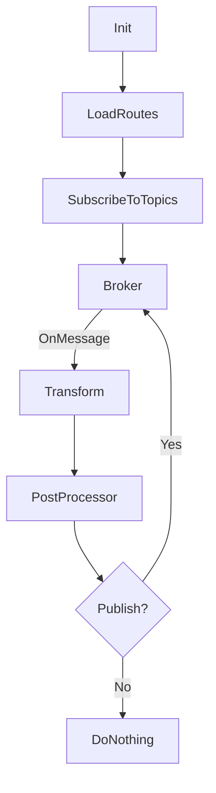

# tedge-mapper-template

Just some free experiments (PoCs) looking at how a template based mapper could look like.

The idea is to have a mapper which supports loading the "routes" from configuration (currently file-based), and applying the routes to different messages.

A route defines which MQTT topic it should be listening to and the transformation template it should apply to any received messages. A user can define multiple routes, however currently only 1 route is allowed per topic. However you can get around this limitation by using one-route which is listening to the common topic and it transform the message to publish to a new unique topics where the other routes can configure to listen to.

The following parameters are configurable within routes:

* Source topic that the route should be listening to
* Topic of the outgoing message
* Control whether the outgoing message should be published or not (by setting the `.skip` property of the message)
* Template to be applied to generate the outgoing message. The template has access to the incoming message as well as some additional configuration which can be used in the message transformation.

In addition to the route configuration, there are also some prevention mechanism to prevent errors when creating custom routes.

* Recursive message counter (to prevent infinite message loops)
* Limit publishing rate (to prevent spamming)
* Control if a message is allowed to be processed by other routes or not (via the `.final` property). Idea is to also allow the route to decide if it's messages are allowed to be accepted by other routes or not.

## Design

Below shows a rough diagram of the flow of a single route which is listening to a specific topic.



## Template language

Currently only [jsonnet](https://jsonnet.org/) is supported. However jsonnet is a very flexible template language which allows you to run your own functions.

The example below shows a more complicated scenario where a template is used to replace any references to the internal Cumulocity IoT URL with the public URL (as read from the environment variables). It uses a custom function which does a recursive search for any strings which contain a wildcard pattern (though the `_.ReplacePattern` function is provided by the application and not the jsonnet library (just in case if you try to run the template on the jsonnet website ;))

```jsonnet
local recurseReplace(any, from, to) = (
  {
    object: function(x) { [k]: recurseReplace(x[k], from, to) for k in std.objectFields(x) },
    array: function(x) [recurseReplace(e, from, to) for e in x],
    string: function(x) _.ReplacePattern(x, from, to),
    number: function(x) x,
    boolean: function(x) x,
    'function': function(x) x,
    'null': function(x) x,
  }[std.type(any)](any)
);

# THIS PART IS THE OUTGOING MESSAGE!
{
  message: recurseReplace(message, 'https?://\\bt\\d+\\.cumulocity.com', meta.env.C8Y_BASEURL),
  final: true,
  topic: topic,
  skip: false,
}
```

## Caveats

* Template based mapping will likely be too slow for high throughput messages (this is a tradeoff for having high configuration)
* Templates are loaded from a yaml spec which contains jsonnet templates embedded
