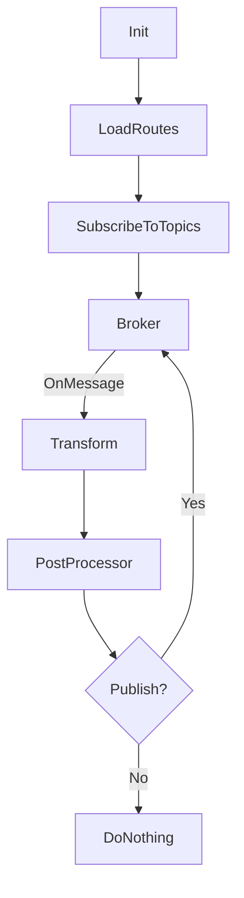

# tedge-mapper-template

Just some free experiments (PoCs) looking at how a template based mapper could look like.

The idea is to have a mapper which supports loading the "routes" from configuration (currently file-based), and applying the routes to different messages.

A route defines which MQTT topic it should be listening to and the transformation template it should apply to any received messages. A user can define multiple routes, however currently only 1 route is allowed per topic. However you can get around this limitation by using one-route which is listening to the common topic and it transform the message to publish to a new unique topics where the other routes can configure to listen to.

The following parameters are configurable within routes:

* Source topic that the route should be listening to
* Topic of the outgoing message
* Control whether the outgoing message should be published or not (by setting the `.skip` property of the message)
* Template to be applied to generate the outgoing message. The template has access to the incoming message as well as some additional configuration which can be used in the message transformation.

In addition to the route configuration, there are also some prevention mechanism to prevent errors when creating custom routes.

* Recursive message counter (to prevent infinite message loops)
* Limit publishing rate (to prevent spamming)
* Control if a message is allowed to be processed by other routes or not (via the `.end` property). Idea is to also allow the route to decide if it's messages are allowed to be accepted by other routes or not.

## Design

Below shows a rough diagram of the flow of a single route which is listening to a specific topic.



## Template language

Currently only [jsonnet](https://jsonnet.org/) is supported. However jsonnet is a very flexible template language which allows you to run your own functions.

The example below shows a more complicated scenario where a template is used to replace any references to the internal Cumulocity IoT URL with the public URL (as read from the environment variables). It uses a custom function which does a recursive search for any strings which contain a wildcard pattern (though the `_.ReplacePattern` function is provided by the application and not the jsonnet library (just in case if you try to run the template on the jsonnet website ;))

```jsonnet
local recurseReplace(any, from, to) = (
  {
    object: function(x) { [k]: recurseReplace(x[k], from, to) for k in std.objectFields(x) },
    array: function(x) [recurseReplace(e, from, to) for e in x],
    string: function(x) _.ReplacePattern(x, from, to),
    number: function(x) x,
    boolean: function(x) x,
    'function': function(x) x,
    'null': function(x) x,
  }[std.type(any)](any)
);

# THIS PART IS THE OUTGOING MESSAGE!
{
  message: recurseReplace(message, 'https?://\\bt\\d+\\.cumulocity.com', meta.env.C8Y_BASEURL),
  end: true,
  topic: topic,
  skip: false,
}
```

To make the templating language more useful, additional variables are also injected into the template each time the template is applied to an incoming message.

|Variable|Description|Example|
|----|----|----|
|`topic`|Topic of the incoming message|`c8y/s/ds/524`|
|`message`|Payload of incoming message (most of the time this is JSON but it can be CSV|`{}`|
|`meta`|Additional meta information which can be used within the templates (e.g. access environment variables `meta.env.<ENV_VARIABLE>`)|`{"device_id":"mydevice","env":{"C8Y_BASEURL":"https://example.cumulocity.com"}}`|
|`te`|Internal Routing information, e.g. how many levels of routes has the message or derivatives of the message|`{"lvl":0}`|
|`_`|Object providing some additional functions like `_.Now()` to get the current timestamp in RFC3334 format|

You can see the exact jsonnet templates used (including the injected runtime information) by specifying the `--debug` flag.

For example, starting the application with `--debug` will print out the full JSONNET template to the console.

```sh
go run main.go serve --debug
```

Below shows an example of full jsonnet template which is applied to the incoming message. 

```jsonnet
local topic = 'c8y/s/ds/524';
local _input = {"id":"524","serial":"DeviceSerial","content":{"url":"http://www.my.url","type":"type"},"payload":"524,DeviceSerial,http://www.my.url,type"};
local message = if std.isObject(_input) then _input + {_ctx:: null} else _input;
local te = {lvl:0} + std.get(_input, '_ctx', {});
local meta = {"device_id":"test","env":{"C8Y_BASEURL":"https://example.cumulocity.com"}};

local _ = {Now: function() std.native('Now')(), ReplacePattern: function(s, from, to='') std.native('ReplacePattern')(s, from, to),};

###

{
    message: message.content,
    topic: 'tedge/operations/req/' + message.serial + '/' + 'download_config',
}
 + {message+: {_ctx: te + {lvl: std.get(te, 'lvl', 0) + 1}}}

```

When the above template is evaluated, the following JSON data is produced. This will be the data which is interpreted by the PostProcessor and published as a MQTT message. It shows that the data structure includes the `.topic` field which is used to tell where the `.message` should be published to. There are additional properties which can also be used to customize the handling of this message.

*Output: Template output*


```json
{
  "message": {
    "_ctx": {
      "lvl": 1
    },
    "type": "type",
    "url": "http://www.my.url"
  },
  "topic": "tedge/operations/req/DeviceSerial/download_config"
}
```

## Caveats

* Template based mapping will likely be too slow for high throughput messages (this is a tradeoff for having high configuration)
* Templates are loaded from a yaml spec which contains jsonnet templates embedded

## Getting started

After checking out the project you can get everything up and running using the following commands.

```sh
go run main.go serve --verbose
```

By default it will listen to the MQTT broker on `localhost:1883`, however it can be changed. Just checkout the options in the help, e.g.

```sh
go run main.go serve --help
```

`tedge-mapper-template` will also load all of the routes in the `./testdata` to help you get an idea what are some of the possibilities.


Once the application has subscribed to the MQTT broker, then you can open another console, and try publishing to a topic which will trigger one of the matching routes. Below is publishing a message using `mosquitto_pub` to the `c8y/s/ds` topic.

```sh
mosquitto_pub -t 'c8y/s/ds' -m '524,DeviceSerial,http://www.my.url,type'
```

Check the output of the `tedge-mapper-template`, and you will see that there activity there showing the processing of some messages:

```log
2023-05-18T21:57:33+02:00 INF Starting listener
2023-05-18T21:57:33+02:00 INF Registering route. name=c8y-operation-smartrest topic=c8y/s/ds
2023-05-18T21:57:33+02:00 INF Registering route. name=shell-operation topic=c8y/s/ds/511
2023-05-18T21:57:33+02:00 INF Registering route. name=download-config-operation topic=c8y/s/ds/524
2023-05-18T21:57:33+02:00 INF Registering route. name=firmware-update-operation topic=c8y/s/ds/515
2023-05-18T21:57:33+02:00 INF Registering route. name=software-update-operation topic=c8y/s/ds/529
2023-05-18T21:57:33+02:00 INF Ignoring route marked as skip. name="Cumulocity Operation Mapper Without Preprocessor" topic=c8y/s/ds
2023-05-18T21:57:33+02:00 INF Ignoring route marked as skip. name="simple measurements" topic=tedge/measurements
2023-05-18T21:57:33+02:00 INF Registering route. name="complex measurements" topic=tedge/measurements/+
2023-05-18T21:57:33+02:00 INF Registering route. name="Trigger event from measurement" topic=tedge/measurements
2023-05-18T21:57:33+02:00 INF Registering route. name="Modify urls" topic=tedge/operations/req/config_update
2023-05-18T21:57:35+02:00 INF Route activated on message. route=c8y-operation-smartrest topic=c8y/s/ds message=524,DeviceSerial,http://www.my.url,type
2023-05-18T21:57:35+02:00 INF Publishing new message. topic=c8y/s/ds/524 message=524,DeviceSerial,http://www.my.url,type
2023-05-18T21:57:37+02:00 INF Route activated on message. route=download-config-operation topic=c8y/s/ds/524 message=524,DeviceSerial,http://www.my.url,type
2023-05-18T21:57:37+02:00 INF Publishing new message. topic=tedge/operations/req/DeviceSerial/download_config message="{\"_ctx\":{\"lvl\":1},\"type\":\"type\",\"url\":\"http://www.my.url\"}"
```

The above log output shows that the `c8y-operation-operation-smartrest` route reacted to an incoming SmartREST message. The route then transformed the message and published a new message on a different topic which includes the SmartREST template id as other routes are listening to specific SmartREST template ids.

The `download-config-operation` route, then reacts and transforms the CSV message into JSON. Below shows a pretty printed version of the outgoing message from this router.

```json
{
    "_ctx": {
        "lvl": 1
    },
    "type": "type",
    "url": "http://www.my.url"
}
```

The `_ctx` fragment is automatically added to the message payload to try and prevent infinite loops. Each time the JSON payload goes through a route, the `_ctx.lvl` will increase by one. Currently the route counter is only added to JSON message (not CSV) due to a limitation. In the future only JSON formats will be supported, so this should not be too limiting. The other two properties, `type` and `url` have been added by the route during the conversion from CSV to JSON (using the in-built preprocessor block). Once the message is in the JSON format, it is much easier for plugins to handle the data, and add/remove fragments as needed.

## Building

You can build the binaries for a range of targets by using the following command, though before you run it, you need to install some tooling which is used to run the projec'ts tasks.

* Install [just](https://just.systems/man/en/chapter_5.html)
* Install [goreleaser](https://goreleaser.com/install/)

Once you've installed the above tools, then you can build the project using:

```sh
just build
```
